# GiveLove Platform - Data Architectural Flow

## Visual Architecture Overview

```mermaid
graph TB
    %% External Input Sources
    Artist[🎤 Artist Portal] --> ArtistActions{Artist Actions}
    Customer[👤 Customer] --> CustomerActions{Customer Actions}
    System[⚙️ System] --> SystemActions{Demand Analytics}

    %% Artist Flow
    ArtistActions --> |Updates Uplift %| PricingContext[📊 PricingContext<br/>React State]
    ArtistActions --> |Views Dashboard| UpliftControl[🎛️ UpliftControl Component]

    %% Customer Flow
    CustomerActions --> |Browses Events| EventPage[🎟️ Event Pages]
    CustomerActions --> |Adds to Cart| CartContext[🛒 UnifiedCartContext]
    CustomerActions --> |Checkout| CheckoutAPI[🔄 /api/checkout]

    %% System Flow
    SystemActions --> |AI Analysis| DemandCalc[🤖 Demand Calculator]
    DemandCalc --> |Suggestions| UpliftControl

    %% State Management Layer
    PricingContext --> |Real-time Updates| EventPage
    PricingContext --> |Persists| LocalStorage[(💾 localStorage)]
    CartContext --> |Session Data| SessionStorage[(🗃️ sessionStorage)]

    %% API & Database Layer
    CheckoutAPI --> |Reads Current Pricing| Database[(🗄️ PostgreSQL<br/>Neon Database)]
    CheckoutAPI --> |Creates Order| Database
    CheckoutAPI --> |Updates Event Stats| Database
    CheckoutAPI --> |Stores Customer| Database
    CheckoutAPI --> |Returns Order| SessionStorage

    %% Database Tables
    Database --> Artists[📋 Artists Table]
    Database --> ArtistPricing[💰 ArtistPricing Table]
    Database --> Events[🎪 Events Table]
    Database --> Orders[🧾 Orders Table]
    Database --> Customers[👥 Customers Table]
    Database --> DemandSuggestions[📈 DemandSuggestions Table]
    Database --> RevenueMetrics[💹 RevenueMetrics Table]

    %% Confirmation Flow
    SessionStorage --> |Order Data| ConfirmationPage[✅ Confirmation Page]
    ConfirmationPage --> |Displays Receipt| Customer

    %% Historical Data Flow
    Orders --> |Aggregated| RevenueMetrics
    Orders --> |Analysis Input| DemandCalc
    Events --> |Sales Data| DemandCalc

    %% Revenue Distribution
    Orders --> |Revenue Split| RevenueFlow{💰 Revenue Distribution}
    RevenueFlow --> |Face Value| ArtistRevenue[🎤 Artist Revenue]
    RevenueFlow --> |Uplift Amount| CharityRevenue[❤️ Charity Revenue]
    RevenueFlow --> |Platform Fee| PlatformRevenue[🏢 Platform Revenue]

    %% Styling
    classDef userInterface fill:#e1f5fe,stroke:#0277bd,stroke-width:2px
    classDef stateLayer fill:#f3e5f5,stroke:#7b1fa2,stroke-width:2px
    classDef apiLayer fill:#e8f5e8,stroke:#388e3c,stroke-width:2px
    classDef databaseLayer fill:#fff3e0,stroke:#f57800,stroke-width:2px
    classDef revenueFlow fill:#ffebee,stroke:#d32f2f,stroke-width:2px

    class Artist,Customer,EventPage,UpliftControl,ConfirmationPage userInterface
    class PricingContext,CartContext,LocalStorage,SessionStorage stateLayer
    class CheckoutAPI,DemandCalc apiLayer
    class Database,Artists,ArtistPricing,Events,Orders,Customers,DemandSuggestions,RevenueMetrics databaseLayer
    class RevenueFlow,ArtistRevenue,CharityRevenue,PlatformRevenue revenueFlow
```

## Data Flow Stages

### 1. Data Creation Points

#### **Artist-Generated Data**
- **Source**: Artist Portal (`/artist/[name]/page.tsx`)
- **Created**: Uplift percentage adjustments (0-200%)
- **Storage**:
  - Immediate: `PricingContext` (React state)
  - Persistent: `localStorage` (browser-level)
  - Historical: `ArtistPricing` table (database)

#### **Customer-Generated Data**
- **Source**: Event pages, checkout flow
- **Created**:
  - Cart selections
  - Customer information (email, name, phone)
  - Purchase orders
- **Storage**:
  - Temporary: `UnifiedCartContext`, `sessionStorage`
  - Permanent: `Orders`, `Customers` tables

#### **System-Generated Data**
- **Source**: Demand analytics algorithm
- **Created**:
  - Uplift suggestions based on ticket sales
  - Demand scores and trends
- **Storage**: `DemandSuggestions` table

### 2. Data Processing Pipeline

### 3. Database Persistence Strategy

#### **Historical Records (Never Deleted)**
- **`Orders` Table**: Complete transaction history
  - Base price at time of purchase
  - Uplift percentage used
  - Revenue breakdown (artist/charity/platform)
  - Payment status and timestamps

- **`RevenueMetrics` Table**: Aggregated financial data
  - Time-period based revenue summaries
  - Artist/charity/platform splits
  - Volume metrics (tickets sold, orders completed)

- **`DemandSuggestions` Table**: AI recommendation history
  - Uplift suggestions with reasoning
  - Demand scores and trends
  - Performance tracking of suggestions

#### **Current State (Live Updates)**
- **`ArtistPricing` Table**: Active pricing configuration
  - Current uplift percentage
  - Base prices
  - Maximum allowed uplift
  - Last updated timestamps

- **`Events` Table**: Live event status
  - Tickets sold/available
  - Event status (active/sold out)
  - Real-time inventory

#### **Reference Data (Slowly Changing)**
- **`Artists` Table**: Artist profiles and charity info
- **`Customers` Table**: Customer contact information

### 4. Revenue Flow Architecture

```mermaid
graph LR
    TicketSale[🎫 Ticket Sale<br/>$224.00] --> Breakdown{Revenue Split}

    Breakdown --> |Face Value<br/>$200.00| Artist[🎤 Artist<br/>Gets full face value]
    Breakdown --> |Uplift Amount<br/>$24.00| Charity[❤️ Charity<br/>Gets uplift amount]
    Breakdown --> |Platform Fee<br/>2.5% + $1.69| Platform[🏢 Platform<br/>Transaction processing]

    Artist --> ArtistDB[(Artist Revenue<br/>Tracked in Orders)]
    Charity --> CharityDB[(Charity Revenue<br/>Tracked in Orders)]
    Platform --> PlatformDB[(Platform Revenue<br/>Tracked in Orders)]
```

### 5. Data Consistency Patterns

#### **Pricing Synchronization**
1. Artist updates uplift in portal
2. `PricingContext` broadcasts to all components
3. Event pages show updated prices immediately
4. Checkout API reads from database for authoritative pricing
5. Order stores pricing snapshot for historical accuracy

#### **Inventory Management**
1. `Events.soldTickets` incremented on successful purchase
2. Real-time availability calculated: `totalTickets - soldTickets`
3. Demand algorithm analyzes sales velocity for suggestions

#### **Data Flow Isolation**
- **Frontend State**: Optimistic updates for user experience
- **Session Storage**: Temporary order data during checkout flow
- **Database**: Source of truth for all historical and financial data
- **Analytics**: Separate demand calculation pipeline

### 6. Key Architectural Decisions

#### **Why Local Storage for Pricing?**
- Immediate UI responsiveness
- Survives page refreshes
- Falls back to database when needed

#### **Why Session Storage for Orders?**
- Temporary data during checkout process
- Cleared after successful completion
- Prevents data leakage between sessions

#### **Why Separate Contexts?**
- `PricingContext`: Artist-controlled, global state
- `CartContext`: Customer-controlled, session state
- Clean separation of concerns

#### **Historical Data Retention**
- Orders: Permanent (financial/legal requirements)
- Pricing snapshots: Permanent (audit trail)
- Demand suggestions: Permanent (ML model training)
- Session data: Temporary (privacy/performance)

This architecture ensures data integrity, real-time responsiveness, and complete auditability while maintaining separation between operational and analytical workloads.